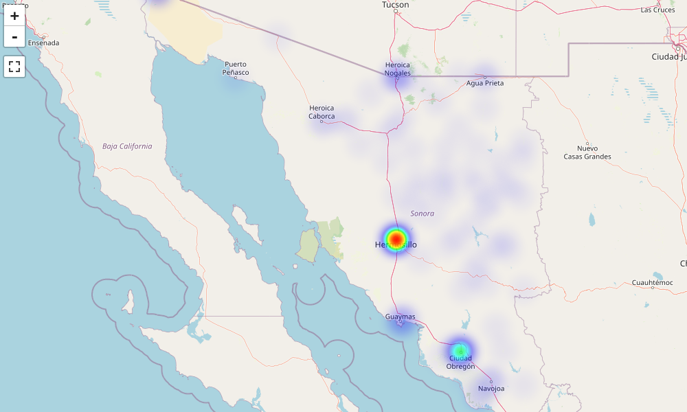

# Mapa de defunciones por COVID19 en municipios Sonora


Este trabajo consiste en generar un "HeatMap" con el número de defunciones por municipio del estado de Sonora. 

Los datos COVID19 son obtenidos directo de la secretaria de salud y los datos geográficos de los municipio son obtenidos directo de INEGI

## Requisitos previos  
- Docker
- Git

## Pasos para visualizar el mapa

1. Clonar el repositorio  
   ```git clone https://github.com/danielmc81/mcd.git```
2. Crear la imagen docker  
   ```docker build -t mcd/covid19 .```
3. Inicializar un contenedor interactivo (-it)con base en la imagen que acabamos de crear. 
   Redirigimos el puerto 8888 (-p) a localhost
   Al finalizar se destruye (--rm) el contenedor  
   ```docker run --rm -it -p 8866:8866 mcd/covid19```  
4. Abrir un explorador en la siguiente dirección  
   ```localhost:8866```

